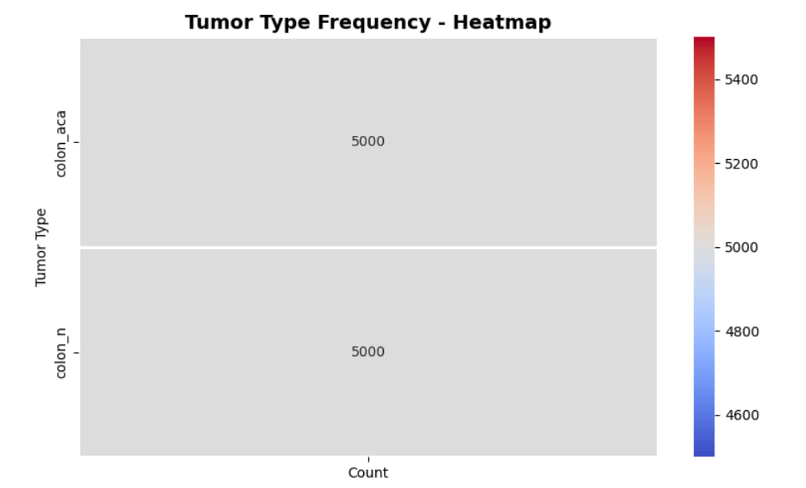

<h1 align="center">Colon Cancer Prediction</h1>

  <h4>Colon Cancer Prediction using ResNet-50.</h4> 
 

 
# Overview
This colon cancer prediction project involves building an image-based classification model using histopathological images of colon tissue. The aim is to develop a robust and accurate deep learning model that assists in early cancer detection and diagnosis. By leveraging convolutional neural networks (CNNs), the project helps pathologists identify malignant tissues more efficiently, improving clinical workflows and patient outcomes—especially critical in the post-COVID-19 healthcare environment, where diagnostic automation can reduce workload and enhance precision.
# Dataset Description
The study utilizes the LC25000 dataset, which contains histopathological images of lung and colon tissues. For this project, only the Colon Adenocarcinoma (cancerous) and Normal Colon (non-cancerous) classes are used. The dataset is divided into training, validation, and test sets to ensure proper generalization and unbiased evaluation.

To maintain classification accuracy and fairness, the dataset is balanced between the two classes. Preprocessing steps include resizing images (e.g., 224×224), normalization, data augmentation, and the removal of redundant or corrupted images. The LC25000 dataset is widely recognized for its applicability in deep learning-based medical image classification tasks.

• Sample of different tissue types in dataset

# Some Screenshots

• Heatmap overlays highlighting Frequency of tumor types. 

# Model Evaluation

| Score | LinearRegression | Support Vector Machine | RandomForest | Gradient Boost| XGBoost|
| ----------- | ----------- | ----------- | ----------- | ----------- | ----------- |
| Train Accuracy | 0.729 | -0.105 | 0.97 | 0.868 |0.870 |
| Test Accuracy | 0.806 | -0.134 | 0.882 | 0.901 | 0.904 |
| CV Score | 0.747 | 0.103 | 0.836 | 0.860 | 0.860 |

• HeatMap

# Conclusion
Model gave 90% accuracy for Medical Insurance Amount Prediction using XGBoost. This project demonstrates the effectiveness of machine learning, particularly XGBoost, in accurately predicting medical insurance costs based on key factors. It aims to enhance cost transparency and planning, benefiting both insurers and customers.
